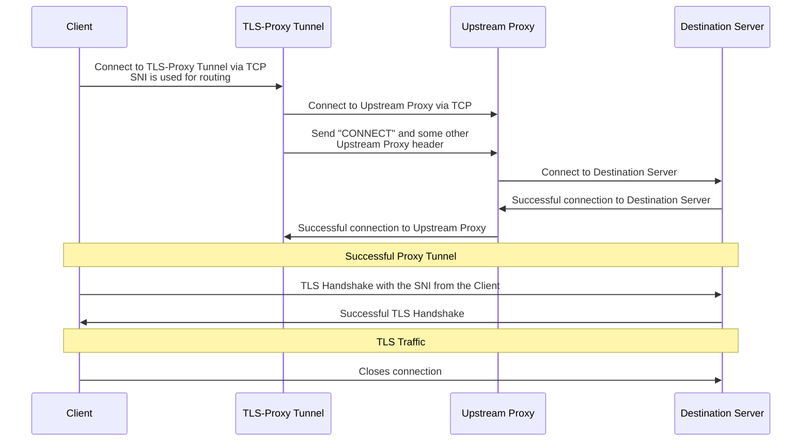

# tls-proxy-tunnel

> Hey, now we are on level 4!


`tls-proxy-tunnel` is a layer 4 proxy implemented by Rust to listen on specific ports and transfer TCP data to remote addresses (only TCP) via a HTTP Proxy according to the configuration.

## Features

- Listen on specific port and proxy to local or remote port
- SNI-based rule without terminating TLS connection
- DNS-based backend with periodic resolution
- Use Upstream HTTP proxy with `via` keyword
- Offer simple HTTP/1.1 health check
- Lookup environment variables with in `${...}`
- Limit client connection by server `maxclients`

## Sequence diagram



## Installation

To gain best performance on your computer's architecture, please consider build the source code. First, you may need [Rust tool chain](https://rustup.rs/).

```bash
$ cd tls-proxy-tunnel
$ cargo build --release
```

Binary file will be generated at `target/release/tls-proxy-tunnel`, or you can use `cargo install --path .` to install.

Or you can use Cargo to install `tls-proxy-tunnel`:

```bash
$ cargo install tls-proxy-tunnel
```

Or you can download binary file form the Release page.

## Configuration

`tls-proxy-tunnel` will read yaml format configuration file from `/etc/tpt/tpt.yaml`, and you can set custom path to environment variable `tpt_CONFIG`, here is an minimal viable example:

```yaml
version: 1
log: info

via: &viaanchor
  target: www.test1.com
  headers:
    Host: www.test1.com
    Proxy-Authorization: Basic ${ENCODED_PW}
    Proxy-KeepAlive: true

servers:
  proxy_server:
    listen:
      - "127.0.0.1:8081"
    default: remote
    maxclients: 3
    via:
      *viaanchor
  health-server:
    listen: [ "127.0.0.1:8081" ]
    default: health
    maxclients: 2
    via:
      *viaanchor

upstream:
  remote: "tcp://www.remote.example.com:8082" # proxy to remote address
```

There are several upstreams built in:
* Ban, which terminates the connection immediately
* Echo, which reflects back with the input
* Health, a simple HTTP/1.1 health check
* Proxy, the proxy upstream

For detailed configuration, check [this example](./config.yaml.example).

## Test run

```shell
TPT_CONFIG=container-files/etc/tpt/config.yaml cargo run
```

## Docker

There is a container Image about this tool.
[tls-proxy-tunnel](https://hub.docker.com/r/me2digital/tls-proxy-tunnel)

## Thanks

- [`fourth`](https://crates.io/crates/fourth), of which this is a heavily modified fork.
- [`layer4-proxy`](https://code.kiers.eu/jjkiers/layer4-proxy)

## License

`tls-proxy-tunnel` (`tpt`) is available under terms of Apache-2.0.