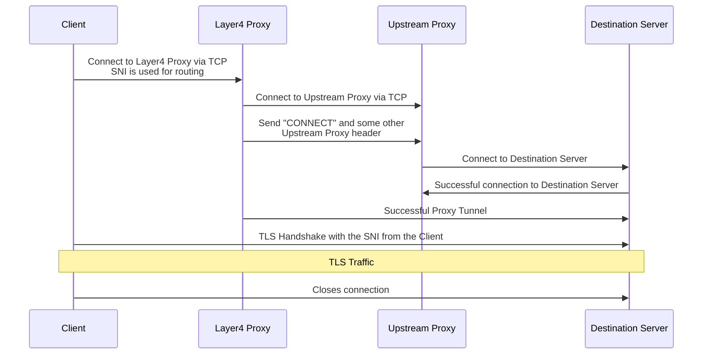

# layer4-proxy

> Hey, now we are on level 4!


`layer4-proxy` is a layer 4 proxy implemented by Rust to listen on specific ports and transfer TCP data to remote addresses (only TCP) according to the configuration.

## Features

- Listen on specific port and proxy to local or remote port
- SNI-based rule without terminating TLS connection
- DNS-based backend with periodic resolution
- Use Upstream HTTP proxy with `via` keyword
- Offer simple HTTP/1.1 health check
- Lookup environment variables with in `${...}`

## Sequence diagram



## Installation

To gain best performance on your computer's architecture, please consider build the source code. First, you may need [Rust tool chain](https://rustup.rs/).

```bash
$ cd layer4-proxy
$ cargo build --release
```

Binary file will be generated at `target/release/layer4-proxy`, or you can use `cargo install --path .` to install.

Or you can use Cargo to install `layer4-proxy`:

```bash
$ cargo install layer4-proxy
```

Or you can download binary file form the Release page.

## Configuration

`layer4-proxy` will read yaml format configuration file from `/etc/l4p/l4p.yaml`, and you can set custom path to environment variable `L4P_CONFIG`, here is an minimal viable example:

```yaml
version: 1
log: info

via: &viaanchor
  target: www.test1.com
  headers:
    Host: www.test1.com
    Proxy-Authorization: basic ${ENCODED_PW}
    Proxy-KeepAlive: true

servers:
  proxy_server:
    listen:
      - "127.0.0.1:8081"
    default: remote
    via:
      *viaanchor
  health-server:
    listen: [ "127.0.0.1:8081" ]
    default: health
    via:
      *viaanchor

upstream:
  remote: "tcp://www.remote.example.com:8082" # proxy to remote address
```

There are two upstreams built in:
* Ban, which terminates the connection immediately
* Echo, which reflects back with the input

For detailed configuration, check [this example](./config.yaml.example).

## Test run

```shell
L4P_CONFIG=container-files/etc/l4p/config.yaml cargo run
```

## Thanks

- [`l4p`](https://crates.io/crates/`l4p`), of which this is a heavily modified fork.
- [`layer4-proxy`](https://code.kiers.eu/jjkiers/layer4-proxy)

## License

`layer4-proxy` is available under terms of Apache-2.0.