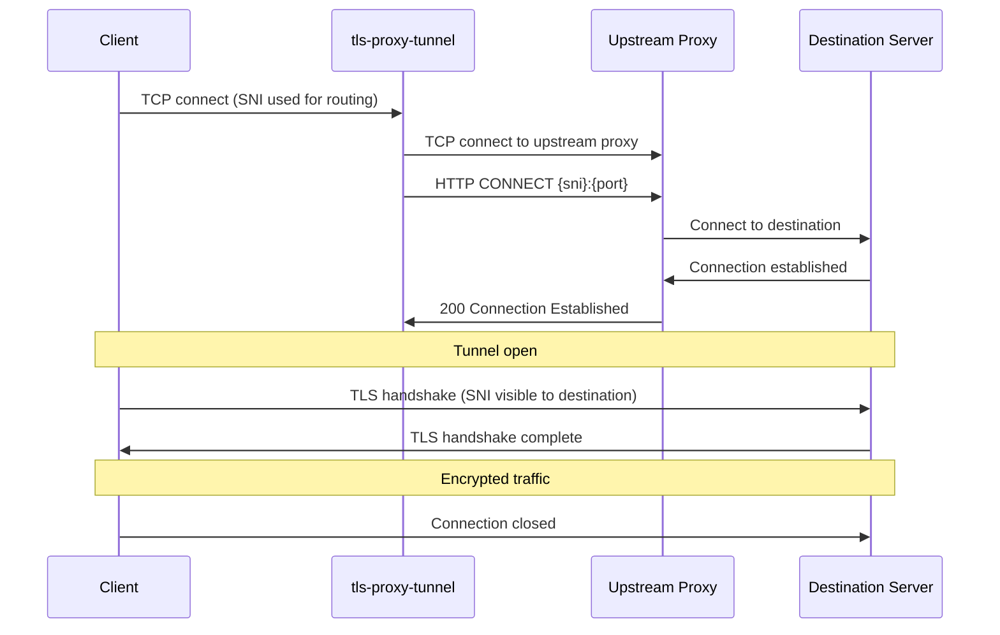

# tls-proxy-tunnel

`tls-proxy-tunnel` (`tpt`) is a layer-4 proxy written in Rust. It listens on
configured ports, peeks at the TLS SNI to select a route, and tunnels the
connection to a remote address — optionally via an HTTP CONNECT proxy.

## Features

- Listen on one or more ports and forward TCP connections
- SNI-based routing without terminating TLS
- DNS backend with periodic re-resolution (`tcp://`, `tcp4://`, `tcp6://`)
- HTTP CONNECT tunnelling with configurable headers and timeout (`via`)
- Environment-variable substitution in header values (`$VARNAME`)
- Per-server connection limit (`maxclients`)
- Prometheus metrics endpoint (`/metrics`)
- Built-in upstreams: `ban`, `echo`, `health`
- JSON or plain-text log format; log level configurable per config or `RUST_LOG`

## Sequence diagram


```mermaid
sequenceDiagram
  participant CL AS Client
  participant LP AS tls-proxy-tunnel
  participant UP AS Upstream Proxy
  participant DS AS Destination Server

  CL->>LP: TCP connect (SNI used for routing)
  LP->>UP: TCP connect to upstream proxy
  LP->>UP: HTTP CONNECT {sni}:{port}
  UP->>DS: Connect to destination
  DS->>UP: Connection established
  UP->>LP: 200 Connection Established
  Note over CL,DS: Tunnel open
  CL->>DS: TLS handshake (SNI visible to destination)
  DS->>CL: TLS handshake complete
  Note over CL,DS: Encrypted traffic
  CL->>DS: Connection closed
```

## Installation

Build from source (requires [Rust toolchain](https://rustup.rs/)):

```bash
cargo build --release
# binary: target/release/tls-proxy-tunnel
```

Install via Cargo:

```bash
cargo install tls-proxy-tunnel
```

Or download a pre-built binary from the Releases page.

## Usage

```
tpt [OPTIONS]

OPTIONS:
    -c, --config <path>    Path to config file
    -h, --help             Show this help
```

When `--config` is not given, `tpt` searches for a config file in this order:

1. `$TPT_CONFIG` environment variable
2. `/etc/tpt/tpt.yaml`
3. `/etc/tpt/config.yaml`
4. `./tpt.yaml`
5. `./config.yaml`

If no arguments are given and no config file is found, the help text is printed.

## Configuration

Config files use YAML. Versions 1 and 2 are supported.

### Minimal example

```yaml
version: 1
log: info

servers:
  proxy_server:
    listen:
      - "0.0.0.0:8443"
    tls: true
    sni:
      www.example.com: corp_proxy
    default: ban
    maxclients: 100
    via:
      use_sni_as_target: true
      target_port: 443
      connect_timeout: 30s

  health_server:
    listen:
      - "127.0.0.1:8080"
    default: health

upstream:
  corp_proxy: "tcp://proxy.internal:3128"
```

### Full `via` reference

```yaml
via:
  target: "host:port"          # static CONNECT target; ignored when use_sni_as_target: true
  use_sni_as_target: true      # derive CONNECT target from TLS SNI
  target_port: 443             # port appended to SNI (default: 443)
  connect_timeout: 30s         # upstream connect timeout (default: 30s)
  stats_interval: 30s          # log rx/tx counters every N seconds (0s = off)
  headers:
    Proxy-Authorization: "Basic $ENCODED_PW"   # $VARNAME resolved from env
    X-Custom-Header: "static-value"
```

`via` can be set at server level (inherited by all SNI entries) or overridden
per SNI entry:

```yaml
sni:
  www.example.com: corp_proxy          # plain string: inherits server via
  intern.corp.org:
    upstream: direct_host
    via: {}                            # via: {} → direct TCP (no CONNECT)
  api.example.com:
    upstream: corp_proxy
    via:                               # per-SNI override
      target: "api.example.com:8443"
      connect_timeout: 10s
```

### Upstream protocols

```yaml
upstream:
  corp_proxy:  "tcp://proxy.internal:3128"    # IPv4 or IPv6
  corp_proxy4: "tcp4://proxy.internal:3128"   # force IPv4
  corp_proxy6: "tcp6://proxy.internal:3128"   # force IPv6
```

### Logging

```yaml
log: info          # off | error | warn | info | debug | trace | disable
log_format: txt    # txt | text | json  (default: txt)
```

`RUST_LOG` takes precedence over the config `log` field.

### Built-in upstreams

| Name | Behaviour |
|------|-----------|
| `ban` | Closes the connection immediately |
| `echo` | Reflects received bytes back to the sender |
| `health` | HTTP/1.1: `GET /health` → `200 OK`, `GET /metrics` → Prometheus text |

### Prometheus metrics

The `health` upstream exposes `/metrics` in Prometheus text format:

```
# HELP tpt_active_connections Current number of active connections
# TYPE tpt_active_connections gauge
tpt_active_connections{name="proxy_server",listen="0.0.0.0:8443"} 3

# HELP tpt_maxclients Maximum number of concurrent connections
# TYPE tpt_maxclients gauge
tpt_maxclients{name="proxy_server",listen="0.0.0.0:8443"} 100
```

## Test run

```bash
TPT_CONFIG=container-files/etc/tpt/config.yaml cargo run
```

## Docker

[tls-proxy-tunnel on Docker Hub](https://hub.docker.com/r/me2digital/tls-proxy-tunnel)

## Thanks

- [`fourth`](https://crates.io/crates/fourth), of which this is a heavily modified fork.
- [`layer4-proxy`](https://code.kiers.eu/jjkiers/layer4-proxy)

## License

`tls-proxy-tunnel` is available under the terms of Apache-2.0.
